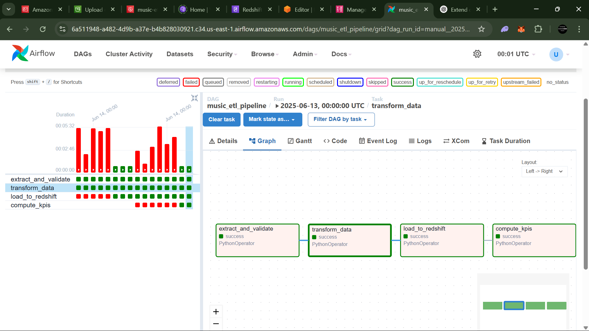

# 🔧 1. Architecture Overview — Design Breakdown


## 📥 Input Data: CSV files uploaded to Amazon S3

**Design Choice:** CSV files for `songs`, `users`, and `streams` are the raw inputs and are manually or programmatically uploaded to a source S3 bucket (e.g. `music-streaming-etl-data`).

**Why this works well:**
* S3 is a durable, highly available, cost-effective object store.
* CSV is a common interchange format; easy to generate and process.
* Using S3 decouples your data source from your processing logic — making the pipeline more scalable and modular.

## ⚙️ Orchestration: Amazon MWAA (Managed Workflows for Apache Airflow)

**Design Choice:** Airflow is used to orchestrate the pipeline steps — from extract to load — and hosted using MWAA.

**Why MWAA:**
* No need to manage Airflow infrastructure.
* Easily integrates with other AWS services like S3, Redshift, and Secrets Manager.
* Supports retries, logging, scheduling, and task dependencies out of the box.

## 🗃️ Storage: Processed files saved back to S3 in Parquet format

**Design Choice:** After validation and transformation, all datasets are saved back into a *processed* S3 bucket (e.g. `music-etl-processed-data`) in **Parquet format**.

**Why Parquet:**
* Columnar format = faster queries in Redshift.
* Smaller size = reduced storage and I/O costs.
* Redshift Spectrum and COPY natively support Parquet — it's optimized for analytical workloads.

## 🧠 Data Warehouse: Amazon Redshift

**Design Choice:** Final structured and analytical data is loaded into Amazon Redshift.

**Why Redshift:**
* Fully managed data warehouse, good for analytical queries.
* Scales well with large volumes of streaming data.
* Integration with COPY command (and Parquet) makes it ideal for batch loading.
* KPI computations are performed directly in Redshift using SQL, leveraging its performance.

## 🔐 Security: AWS Secrets Manager for credentials

**Design Choice:** Instead of hardcoding secrets or using `.env` files in production, we store DB credentials and IAM roles securely in Secrets Manager.

**Why Secrets Manager:**
* Centralized, encrypted secret storage.
* Rotatable secrets.
* Easy integration with Airflow via environment variables or programmatic access.

## 🔄 Data Flow Steps

### 1. Extract + Validate from S3
* Read raw CSVs from `music-streaming-etl-data`.
* Validate schema and data types.
* Output clean datasets as `.parquet` to `music-etl-processed-data`.

### 2. Transform and Normalize
* Clean genre, country, timestamp formats.
* Add derived columns (e.g. `hour`, `duration_sec`).
* Each dataset is processed independently and saved to `transformed-data/`.

### 3. Load to Redshift
* Users and songs are deduplicated using staging tables (upsert logic).
* Streams are **appended** (no duplication logic, as each batch is time-based and unique).

### 4. Compute KPIs
* Redshift SQL computes per-genre and per-hour KPIs.
* KPI tables are updated (either overwritten or merged depending on design).


Great — let’s now dive into:

---

## 📁 2. Folder Structure (Local Setup) — Design Breakdown

```bash
project-root/
├── dags/
│   └── etl_pipeline_dag.py         # Main Airflow DAG
│   ├── extract_and_validate.py     # Data extraction + validation logic
│   ├── transform.py                # Transformation logic
│   ├── load_to_redshift.py         # Loading to Redshift with dedup logic
│   ├── compute_kpis.py             # KPI computations from transformed data
│   └── utils.py                    # Shared utility functions (S3, manifest, logging, etc.)
│
.env                                # Local-only: secrets for testing
requirements.txt                    # All Python + Airflow dependencies
```

---

### 🔹 Why This Folder Layout?

#### `dags/`

* **Purpose**: Holds the DAG definition (`etl_pipeline_dag.py`) — the orchestration logic.
* **Why separate?** Airflow only scans this folder for DAGs, not supporting files. This ensures DAG code stays minimal and imports actual logic from `tasks/`.


#### `utils.py`

* **Purpose**: Shared helper methods, such as:

  * Reading/writing to S3
  * Reading/Updating manifest files
  * Listing files in S3
  * Logging setup
* **Why it’s separate**: Avoids code duplication and keeps each task file focused.

#### `.env`

* **Local use only**. Contains secrets like AWS keys and Redshift credentials for local testing.
* **Why exclude in production?**

  * In MWAA, you use **AWS Secrets Manager**, not `.env`.

#### `requirements.txt`

* Includes:

  * `pandas`, `pyarrow`, `psycopg2`, `boto3`
  * `apache-airflow-providers-amazon`
* **Why?** Ensures MWAA and your local environment have consistent dependencies.


## ☁️ 3. AWS Setup Steps — Design Breakdown

This section outlines the cloud resources needed to run the pipeline seamlessly on AWS and the reasoning behind each.

---

### 🔹 a. **S3 Buckets**

| Bucket Name                | Purpose                                       |
| -------------------------- | --------------------------------------------- |
| `music-streaming-etl-data` | Stores raw source files (CSV uploads)         |
| `music-etl-processed-data` | Stores cleaned, transformed files + manifests |

**Design Reasons:**

* **Decoupling**: Separates raw and processed data for traceability and reprocessing if needed.
* **Scalability**: S3 handles massive file volumes efficiently.
* **Organization**: The use of prefixes like `metadata/`, `validated-data/`, `transformed-data/` keeps the pipeline modular and auditable.

---

### 🔹 b. **Secrets Manager**

| Secret Name | `music-etl-secrets`                 |
| ----------- | ----------------------------------- |
| Contains    | Redshift credentials + IAM Role ARN |
| Format      | JSON                                |

**Sample Value:**

```json
{
  "REDSHIFT_DB": "dev",
  "REDSHIFT_USER": "awsuser",
  "REDSHIFT_PASSWORD": "your-password",
  "REDSHIFT_HOST": "your-redshift-endpoint",
  "REDSHIFT_PORT": "5439",
  "REDSHIFT_IAM_ROLE": "arn:aws:iam::your-account:role/your-redshift-role"
}
```

**Why Secrets Manager?**

* **Security**: Credentials never live in code or environment variables.
* **Integration**: MWAA can easily pull secrets using `boto3`.
* **Flexibility**: Secrets can be rotated, versioned, and scoped per environment.

---

### 🔹 c. **Amazon Redshift**

**Setup:**

* Create a **Redshift cluster** (`dev` or `production` DB)
* Set **port 5439**
* Enable **public accessibility** (for testing or controlled MWAA access)
* Attach an **IAM role** with **S3 read permissions**

**Why Redshift?**

* **Scalable data warehouse**: optimized for analytics and aggregations.
* **Built-in COPY command** for fast data ingestion.
* **Parquet support** allows efficient columnar storage and loads.

---

### 🔹 Optional: MWAA Execution Role

Make sure your MWAA execution role has permission to:

* Read from `SecretsManager`
* Access your input/output S3 buckets
* (Optional) Push logs to CloudWatch for observability

---

### 🔄 Summary of Key AWS Resources

| Component              | AWS Service          | Example Resource Name                                  |
| ---------------------- | -------------------- | ------------------------------------------------------ |
| File Storage           | Amazon S3            | `music-streaming-etl-data`, `music-etl-processed-data` |
| Pipeline Orchestration | Amazon MWAA          | `music-etl-airflow-env`                                |
| Data Warehouse         | Amazon Redshift      | `etl-music-cluster`                                    |
| Secrets Management     | AWS Secrets Manager  | `music-etl-secrets`                                    |
| Permissions            | IAM Roles & Policies | `RedshiftS3AccessRole`                                 |

---


Great — let’s cover **both**:

---

## 🧪 4. Local Testing Setup — Before Moving to MWAA

Before deploying to MWAA, everything should be runnable **locally** using standard Airflow.

---

### ✅ Local Testing Setup

#### 1. **Install Dependencies**

Ensure Python 3.9+ and virtualenv are installed.

```bash
pip install -r requirements.txt
```

`requirements.txt` includes:

* `apache-airflow`
* `boto3`, `pyarrow`, `pandas`, `psycopg2-binary`
* `python-dotenv` (for local `.env` use)

---

#### 2. **.env File for Local Secrets**

At the project root:

```ini
AWS_ACCESS_KEY_ID=xxx
AWS_SECRET_ACCESS_KEY=xxx
AWS_DEFAULT_REGION=us-east-1

REDSHIFT_DB=dev
REDSHIFT_USER=awsuser
REDSHIFT_PASSWORD=secret
REDSHIFT_HOST=your-cluster.region.redshift.amazonaws.com
REDSHIFT_PORT=5439
REDSHIFT_IAM_ROLE=arn:aws:iam::...:role/YourRedshiftS3Role
```

This is **only for local use**. MWAA will use **Secrets Manager**.

---

#### 3. **Run Scripts Locally**

Each file (e.g. `extract_and_validate.py`, `transform.py`) can be run like:

```bash
python tasks/extract_and_validate.py
```

This is great for debugging, quick iterations, and validating the full pipeline before scheduling.

---

#### 4. **Local Airflow Testing**

If you want to simulate scheduling:

```bash
# Initialize
airflow db init
airflow users create --username admin --password admin --role Admin --email you@example.com --firstname First --lastname Last

# Start UI and Scheduler
airflow webserver --port 8080
airflow scheduler
```

Your DAG `music_etl_pipeline` should appear in the UI.

---

## ☁️ MWAA Configuration + Role Setup

### 🏗️ 1. Create MWAA Environment

1. Go to **Amazon MWAA → Create Environment**
2. Set:

   * DAG S3 path (e.g. `s3://your-bucket/dags/`)
   * Execution Role (e.g. `MWAAExecutionRole`)
   * Requirements file: point to `requirements.txt` in S3
   * Enable logging (CloudWatch)

---

### 🔐 2. IAM Role for MWAA (Execution Role)

**MWAAExecutionRole** needs access to:

* `SecretsManager:GetSecretValue`
* `s3:GetObject`, `s3:ListBucket`
* (Optional) `logs:*` for CloudWatch

✅ Also attach `AmazonMWAAWebAccess` and `AmazonRedshiftAllCommandsFullAccess` (or scoped Redshift policies).

---

### 🔑 3. MWAA Uses Secrets, Not .env

Replace your local `.env` usage like:

```python
# Local
from dotenv import load_dotenv
load_dotenv()
password = os.getenv("REDSHIFT_PASSWORD")

# MWAA Production
password = get_secret()["REDSHIFT_PASSWORD"]
```

Where `get_secret()` is your `boto3` function to fetch secrets from AWS Secrets Manager.

---

### ⬆️ 4. Deploying to MWAA

* Upload csvs and dag files to the S3 path you configured

---


## 🧩 5. DAG Logic & Orchestration Flow

This section explains how your **Airflow DAG** is structured to orchestrate the pipeline, and why it's designed that way.




---

### 🔹 DAG Overview

```python
from airflow import DAG
from airflow.operators.python import PythonOperator
from datetime import datetime, timedelta

from tasks.extract_and_validate import extract_and_validate
from tasks.transform import transform
from tasks.load_to_redshift import load_all
from tasks.compute_kpis import compute_kpis  # optional KPI logic

with DAG(
    dag_id="music_etl_pipeline",
    default_args={
        "owner": "airflow",
        "retries": 1,
        "retry_delay": timedelta(minutes=5),
    },
    description="ETL for music streaming data using S3 + Redshift",
    schedule_interval="@daily",
    start_date=datetime(2025, 6, 12),
    catchup=False,
    tags=["music", "etl", "s3"],
) as dag:

    extract_task = PythonOperator(
        task_id="extract_and_validate",
        python_callable=extract_and_validate,
    )

    transform_task = PythonOperator(
        task_id="transform_data",
        python_callable=transform,
    )

    load_task = PythonOperator(
        task_id="load_to_redshift",
        python_callable=load_all,
    )

    compute_kpis_task = PythonOperator(
        task_id="compute_kpis",
        python_callable=compute_kpis,
    )

    extract_task >> transform_task >> load_task >> compute_kpis_task
```

---

### 🧠 Why This DAG Flow?

| Step                   | Description                                                           | Reason                                                                  |
| ---------------------- | --------------------------------------------------------------------- | ----------------------------------------------------------------------- |
| `extract_and_validate` | Pulls files from S3, validates schema/quality, saves as Parquet       | Keeps raw data clean + standardized for efficient downstream processing |
| `transform`            | Applies column normalization, type casting, and derives extra fields  | Reduces noise and ensures readiness for analytics and Redshift loading  |
| `load_to_redshift`     | Inserts into staging tables, deduplicates into raw + processed tables | Prevents duplicate data, supports incremental growth                    |
| `compute_kpis`         | Optional task that runs SQL against Redshift to compute KPIs          | Separates transformation from analytics to reduce DAG complexity        |

---

### ⚙️ Scheduling: `@daily`

* **Why daily?** The stream data is expected to arrive in batches.
* **Each run**:

  * Detects and processes only new files (via manifest logic).
  * Appends only new data (for streams) or deduplicates (for songs/users).

---

### 🛡️ Idempotency + Safety

* **Stream deduplication** handled using S3 manifest logic.
* **Songs/Users deduplication** handled via staging tables + insert `NOT EXISTS`.

---

Awesome. Let’s now walk through:

---

## 🔄 6. Data Flow Walkthrough

This section describes exactly **how data flows** across each part of the pipeline, including **what happens at every step**, what files are touched, and **why**.

---

### 🔁 Step-by-Step Flow

#### 1. **Raw Data Uploaded to S3**

* **Files:**

  * `songs.csv` → `s3://music-streaming-etl-data/metadata/songs/`
  * `users.csv` → `s3://music-streaming-etl-data/metadata/users/`
  * `streams1.csv`, `streams2.csv`, ... → `s3://music-streaming-etl-data/streams/`

> These represent raw data arriving externally or in batches.

---

#### 2. **Airflow DAG Starts** → `extract_and_validate.py`

* ✅ Validates:

  * Required columns
  * Missing/null fields
  * Data types (e.g. `int`, `date`, `timestamp`)
  * Value ranges (e.g. age 13–120, non-negative durations)
* ✅ Converts:

  * Data into **cleaned pandas DataFrames**
  * Saves them as **Parquet** to `s3://music-etl-processed-data/validated-data/*.parquet`
* ✅ Updates:

  * **Manifest file** (`processed_stream_files.txt`) to avoid reprocessing past batches

---

#### 3. **DAG Continues** → `transform.py`

* **Transformed Outputs:**

  * `transformed_users.parquet`
  * `transformed_songs.parquet`
  * `streams1_transformed.parquet`, `streams2_transformed.parquet`, etc.

* ✅ Normalizes:

  * Genre strings
  * Time columns (`created_at`, `listen_time`)

* ✅ Derives:

  * `duration_sec` from `duration_ms`
  * `hour` from `listen_time`

* ✅ Appends transformed files to:
  `s3://music-etl-processed-data/transformed-data/`

---

#### 4. **DAG Continues** → `load_to_redshift.py`

* ✅ Raw and Transformed Tables:

  * `raw_users`, `raw_songs` (deduplicated inserts from staging)
  * `transformed_users`, `transformed_songs` (new step!)
  * `transformed_streams` (only new files, no reloading old ones)

* ✅ Parquet data is COPY’d into Redshift tables using IAM role access.

* ✅ Uses:

  * **Staging tables** to deduplicate songs/users by `track_id` and `user_id`
  * **S3 manifest** to skip previously loaded stream files

---

#### 5. **DAG Continues** → `compute_kpis.py` (optional)

* ✅ Runs SQL queries on Redshift like:

  * Top artists by hour
  * Most popular genre
  * Listening pattern by hour
  * Track diversity index
* ✅ Saves results as:

  * `genre_kpis.csv`
  * `hourly_kpis.csv`
* (These can optionally be pushed to S3 or BI dashboards.)

---

Great! Let’s dive into:

---

## 📊 7. KPI Outputs in Redshift

Once your data is loaded and transformed in Redshift, KPIs (Key Performance Indicators) are computed **directly in the warehouse** for speed, scalability, and analytical flexibility.

---

### 🧠 KPI Computation Strategy

All KPIs are generated from **three main tables** in Redshift:

* `transformed_users`
* `transformed_songs`
* `transformed_streams`

These contain only **clean**, **normalized**, and **append-only** data — ideal for analytics.

---

### 📈 Types of KPIs Generated

#### 1. 🎵 **Genre KPIs**

Table: `genre_kpis` (or temporary result for dashboard)

```sql
SELECT
    s.track_genre,
    COUNT(*) AS total_plays,
    ROUND(AVG(s.popularity), 1) AS avg_popularity,
    ROUND(AVG(s.duration_ms) / 1000, 2) AS avg_duration_sec
FROM
    transformed_songs s
JOIN
    transformed_streams t ON s.track_id = t.track_id
GROUP BY
    s.track_genre
ORDER BY
    total_plays DESC;
```

> 💡 Helps identify what genres are trending.

---

#### 2. ⏱️ **Hourly Listening KPIs**

Table: `hourly_kpis`

```sql
SELECT
    t.hour,
    COUNT(DISTINCT t.user_id) AS unique_listeners,
    COUNT(*) AS total_plays,
    COUNT(DISTINCT t.track_id) AS unique_tracks,
    ROUND(COUNT(DISTINCT t.track_id)::decimal / COUNT(*), 3) AS track_diversity_index
FROM
    transformed_streams t
GROUP BY
    t.hour
ORDER BY
    t.hour;
```

> 💡 Shows user behavior across the day.

---

#### 3. 🌟 **Top Artist Per Hour**

```sql
SELECT DISTINCT ON (t.hour)
    t.hour,
    s.artists,
    COUNT(*) OVER (PARTITION BY t.hour, s.artists) AS play_count
FROM
    transformed_streams t
JOIN
    transformed_songs s ON t.track_id = s.track_id
ORDER BY
    t.hour, play_count DESC;
```

> 💡 Tells which artists are dominating at what times.

---

### 🔄 When Are KPIs Updated?

* On **every DAG run**
* After new data is **loaded**
* Existing Redshift data is used — no S3 re-reads

---

### ✅ Benefits of In-Redshift KPI Computation

| Feature           | Why it matters                                                 |
| ----------------- | -------------------------------------------------------------- |
| Centralized logic | All logic stays in Redshift — no redundant computation in DAGs |
| Speed             | Redshift handles large volumes efficiently with SQL            |
| BI-ready          | Easily plug into QuickSight, Tableau, or export to S3          |
| Automation        | KPIs always reflect the latest available stream data           |

---
